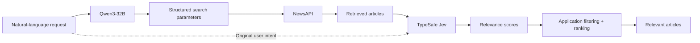
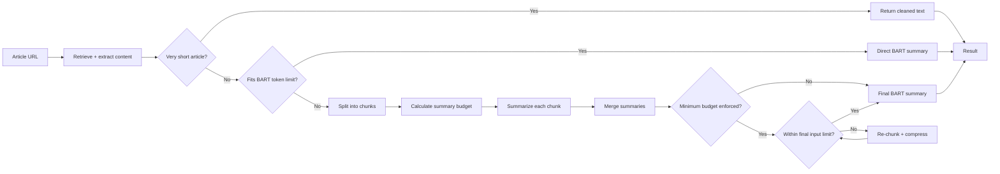

# AI News Agent

A C# ASP.NET Core Web API for AI-powered news search, semantic relevance evaluation, article extraction, and summarization.

The application integrates multiple AI models with distinct responsibilities: **Qwen3-32B** interprets natural-language news requests, **TypeSafe Jev** evaluates retrieved articles for semantic relevance, and **BART** (`facebook/bart-large-cnn`) summarizes article content through a custom token-aware pipeline designed around the model's input and output constraints.

Application code remains in control of search execution, relevance thresholds, filtering, ranking, fallback behavior, and API responses.

> **Version:** `v1.3-ai-search`
>
> **Note:** This version introduces natural-language news search with Qwen3-32B and semantic relevance evaluation with Jev, adding application-controlled relevance filtering and ranking while preserving the existing article extraction and BART summarization workflows.

---

## Features

### Natural-Language Query Interpretation (Qwen3-32B)

Uses **Qwen3-32B** to translate a user's natural-language request, such as `"Show me recent news about Xbox games, not hardware or accessories"`, into structured parameters that can be executed against NewsAPI.

- Extracts search intent into parameters such as keywords, date range, language, and sort order.
- Keeps execution of the generated parameters under application control rather than allowing the model to directly perform the search.
- Implemented through `QueryParserService`, with model behavior and settings handled through configuration.

### Semantic Article Relevance Evaluation (TypeSafe Jev)

Uses **TypeSafe Jev 1.13** to evaluate retrieved articles against the user's original natural-language request before results are returned. Jev's decision-oriented model is well suited for **fast result evaluation** because it returns structured relevance scores rather than generating free-form text responses.

- Evaluates retrieved articles in a single batched relevance request through the OpenRouter Decisions API.
- Applies an application-controlled relevance threshold, currently configured at `0.50`.
- Filters articles that do not meet the threshold and returns qualifying results in descending relevance order.
- If Jev evaluation is unavailable, the workflow gracefully falls back to the retrieved NewsAPI results without relevance scores rather than failing the entire search.

### News Search and Retrieval (NewsAPI)

Uses `NewsApiService` to execute searches using the structured parameters produced from the user's request. The application controls the number of retrieved articles, currently up to 20, before semantic relevance evaluation.

### Article Content Extraction

Uses `ArticleBodyService`, `HttpClient`, and `HtmlAgilityPack` to retrieve and extract usable article content from news URLs.

- Prioritizes semantic article content and known content containers.
- Falls back to the `<div>` containing the most paragraph content when a clear article container cannot be identified.

### JavaScript Rendering Fallback (Playwright)

Uses `PlaywrightRenderService` to render JavaScript-dependent pages when normal HTTP retrieval does not provide usable article content, then passes the rendered HTML back through the extraction process.

### Token-Aware Article Summarization (BART)

Uses **BART** (`facebook/bart-large-cnn`) to summarize extracted article content while explicitly accounting for the model's input and output constraints.

- Determines when an article exceeds BART's token limit and requires chunking.
- Breaks larger articles into smaller chunks, summarizes each individually, and combines the results for final summarization.
- Recursively re-chunks and compresses combined summaries when they still exceed the final summary token limit.
- Very short articles return cleaned text directly, avoiding an unnecessary model call.

### API Documentation and Error Handling

- Provides interactive **Swagger / OpenAPI** documentation with XML endpoint descriptions.
- Uses centralized `Result<T>` handling, standardized `ProblemDetails` responses, and structured logging for application errors and workflow failures.

---

## Technologies Used

- **ASP.NET Core Web API** - Backend framework for HTTP routing, dependency injection, and middleware.
- **Qwen3-32B** - Large language model used to interpret natural-language news requests and produce structured search parameters.
- **TypeSafe Jev 1.13** - Semantic relevance model used to evaluate how closely retrieved articles match the user's original request.
- **BART (`facebook/bart-large-cnn`)** - Text summarization model used by the article summarization pipeline.
- **Hugging Face Inference API** - Provides model inference for Qwen3-32B and BART.
- **OpenRouter Decisions API** - Provides batched Jev relevance evaluation.
- **NewsAPI** - Provides news headline and article search data.
- **HtmlAgilityPack** - Parses retrieved HTML and extracts article content.
- **Microsoft Playwright** - Headless browser fallback for HTML extraction on JavaScript-heavy pages.
- **Swagger / OpenAPI** - Interactive API documentation and endpoint testing.

---

## Architecture

The application separates AI model responsibilities from deterministic application behavior across two independent workflows: natural-language news search and article summarization.

### Natural-Language News Search



Qwen and Jev provide model-driven interpretation and relevance evaluation, while search execution, result limits, relevance thresholds, filtering, ranking, and fallback behavior remain controlled by the application.

If no retrieved articles meet the configured relevance threshold, the API returns an empty result set. If Jev evaluation is unavailable or fails at the request level, the application gracefully falls back to the retrieved NewsAPI articles without relevance scores.

### Article Extraction and Summarization

Article summarization operates independently from natural-language news search. An article URL is retrieved, its content is extracted, and the resulting text is passed through the BART summarization pipeline.



Article retrieval first uses `HttpClient` and `HtmlAgilityPack`. When normal retrieval cannot provide usable content, Playwright provides a JavaScript-rendering fallback before the extracted content enters the summarization pipeline.

> **Summarization design:** The BART pipeline intentionally demonstrates handling a model with constrained input and output limits through token-aware chunking, dynamic summary budgets, and recursive re-chunking. The current implementation prioritizes demonstrating these techniques rather than minimizing summarization time by using a modern long-context model.
>
> Detailed test evidence for chunking, Playwright fallback, and recursive re-chunking is documented in [`docs/manual-testing.md`](docs/manual-testing.md).

---

## API Endpoints

| Endpoint | Description |
|---|---|
| `GET /api/Articles/top-headlines` | Retrieves top headlines for a given `country` and `pageSize`. |
| `GET /api/Articles/search` | Interprets a natural-language `query` with Qwen, retrieves candidate articles from NewsAPI, evaluates relevance with Jev, and returns qualifying results ranked by relevance. |
| `GET /api/Articles/body` | Extracts and returns article content from a supplied `url`. |
| `GET /api/Articles/summarize` | Runs the complete article summarization workflow for a supplied `url`, including content extraction and BART summarization. |

---

## Example Results

### Natural-Language Search with Qwen + Jev

A natural-language request is interpreted by Qwen and converted into structured NewsAPI search parameters. Jev then evaluates the retrieved articles against the original request, allowing the API to filter unrelated results and return qualifying articles in descending relevance order.

**Example request:**

`Find recent news articles about artificial intelligence products, not AI company funding or stock prices`


### BART Article Summarization

Article content can be extracted and summarized through the separate BART pipeline. Longer articles are automatically processed through the token-aware chunking and compression workflow before the final summary is generated.


### Swagger API

The application exposes its search, extraction, and summarization capabilities through an ASP.NET Core Web API with interactive Swagger documentation.


For detailed validation scenarios, fallback behavior, logs, and additional screenshots, see [docs/manual-testing.md](docs/manual-testing.md).

---

## Setup

### 1. Local Configuration

Copy the development configuration template to create your local `appsettings.json`:

```bash
cp appsettings.Development.template.json appsettings.json
```

Add the required API keys to `appsettings.json`:

- **NewsAPI Key** - Required for top headlines and article search. [NewsAPI](https://newsapi.org/)
- **Hugging Face API Key** - Required for Qwen query interpretation and BART summarization. [Hugging Face](https://huggingface.co/)
- **OpenRouter API Key** - Required for Jev relevance evaluation. [OpenRouter](https://openrouter.ai/)

Model configuration, the maximum number of articles retrieved for relevance evaluation, and the minimum relevance threshold can also be configured under the `AI` section of `appsettings.json`.

### 2. Install Playwright

Install the Microsoft Playwright CLI and browser dependencies:

```bash
dotnet tool install --global Microsoft.Playwright.CLI
playwright install
```

Playwright is used as a fallback when article content cannot be retrieved successfully through the normal HTTP extraction path.

---

## Running the Web API

Launch the API:

```bash
dotnet run
```

Once the application is running, open Swagger:

```text
https://localhost:7044/swagger/index.html
```

Swagger can be used to:

- Submit natural-language news searches through `/api/Articles/search`
- Retrieve top headlines through `/api/Articles/top-headlines`
- Extract article content through `/api/Articles/body`
- Generate article summaries through `/api/Articles/summarize`
- Inspect request parameters, response schemas, and `ProblemDetails` error responses

---

## Testing

Manual validation covers the primary search, extraction, fallback, and summarization workflows, including:

- NewsAPI headline and search retrieval
- Natural-language query interpretation with Qwen
- Jev relevance evaluation, filtering, and ranking
- Jev graceful degradation behavior
- Article extraction and HTML fallback behavior
- Playwright rendering fallback
- Short and chunked BART summarization
- Recursive re-chunking for large articles

See [docs/manual-testing.md](docs/manual-testing.md) for detailed test scenarios, expected behavior, logs, and screenshots.
